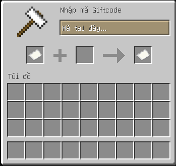
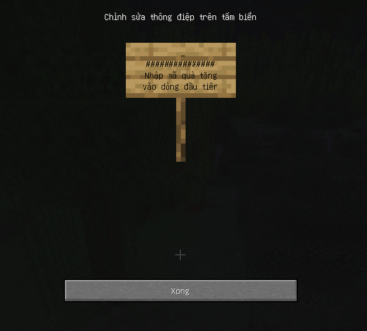
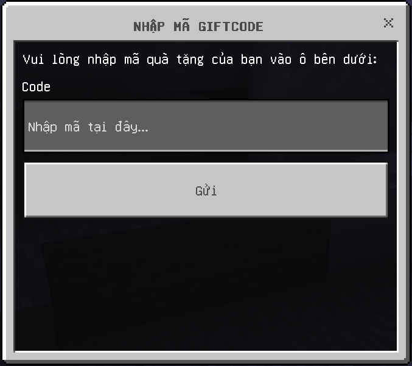
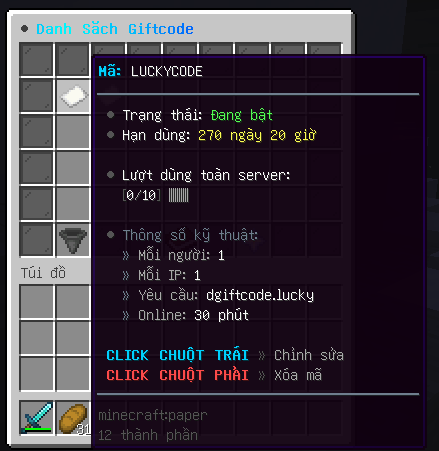

# dGiftcode
[](https://dunz.me)
[](https://dunz.me/discord)
[](https://github.com/QuangDunz/dGiftcode/releases)
[](https://github.com/QuangDunz/dGiftcode)

Plugin quản lý mã quà tặng (Giftcode) chuyên nghiệp nhất cho server Minecraft, hỗ trợ đa nền tảng Java & Bedrock với giao diện tùy biến linh hoạt.

## Tính năng hiện có
- **Đa nền tảng**: Tự động nhận diện và hiển thị giao diện phù hợp cho Java (Anvil/Sign), Bedrock (Modal Form) và cả Java/Bedrock (Dialog UI 1.21.7+).
- **Giao diện hiện đại**: Hỗ trợ màu Hex (#RRGGBB) và MiniMessage Gradient rực rỡ.
- **Quản trị GUI**: Tạo, sửa, và thiết lập phần thưởng hoàn toàn qua giao diện trong game.
- **Phần thưởng đa dạng**: Hỗ trợ Vật phẩm (NBT), Vault, PlayerPoints, Kinh nghiệm và Lệnh thực thi.
- **Bulk Generator**: Tạo hàng loạt mã ngẫu nhiên cực nhanh.
- **Bảo mật & Giới hạn**: Hỗ trợ giới hạn theo IP, tổng lượt dùng, lượt dùng mỗi người và thời gian hết hạn.
- **Điều kiện nhận mã**: Yêu cầu quyền (Permission) hoặc thời gian chơi (Playtime).

## Hướng dẫn sử dụng
### Cài đặt plugin
- Plugin yêu cầu **[dLib](https://github.com/QuangDunz/dLib)** và **Java 21** để hoạt động.
- Các plugin hỗ trợ (không bắt buộc):
    - **[Floodgate](https://github.com/GeyserMC/Floodgate)**: Để hiển thị giao diện cho người chơi Bedrock.
    - **[PlaceholderAPI](https://www.spigotmc.org/resources/placeholderapi.6245/)**: Để sử dụng biến hiển thị.
    - **Vault / PlayerPoints**: Để trao thưởng tiền tệ.
- Tải plugin, bỏ vào thư mục `plugins` và khởi động lại server.

### Danh sách lệnh
| Lệnh | Quyền | Mô tả |
| :--- | :--- | :--- |
| `/giftcode` | Không | Mở giao diện nhập mã quà tặng. |
| `/giftcode gui` | `dgiftcode.admin` | **Dashboard Quản trị**: Quản lý tất cả mã qua giao diện. |
| `/giftcode create <id>` | `dgiftcode.admin` | Tạo mã mới với ID xác định. |
| `/giftcode delete <id>` | `dgiftcode.admin` | Xóa một mã khỏi hệ thống. |
| `/giftcode edit <id>` | `dgiftcode.admin` | Chỉnh sửa sâu: Giới hạn IP, lượt dùng, thời gian... |
| `/giftcode info <id>` | `dgiftcode.admin` | Xem chi tiết thông số và lượt dùng của mã. |
| `/giftcode status <id>` | `dgiftcode.admin` | Bật hoặc Tắt hoạt động của mã ngay lập tức. |
| `/giftcode reward <id>` | `dgiftcode.admin` | Thiết lập kho vật phẩm phần thưởng cho mã. |
| `/giftcode bulk <sl>` | `dgiftcode.admin` | Tạo mã hàng loạt nhanh chóng. |
| `/giftcode reload` | `dgiftcode.admin` | Tải lại cấu hình và cơ sở dữ liệu ngay lập tức. |

### Placeholder
Sử dụng qua PlaceholderAPI để hiển thị thông tin:
- `%dgiftcode_total_codes%`: Tổng số mã hiện có.
- `%dgiftcode_player_totalused%`: Tổng số mã người chơi đã nhập.
- `%dgiftcode_code_used_<id>%`: Số lượt đã dùng của mã `<id>`.
- `%dgiftcode_code_maxuses_<id>%`: Giới hạn lượt dùng của mã `<id>`.
- `%dgiftcode_code_expiry_<id>%`: Ngày hết hạn của mã.
- `%dgiftcode_code_playeruses_<id>%`: Số lần người chơi hiện tại đã dùng mã này.

### Config plugin
Cấu trúc thư mục `./plugins/dGiftcode` như sau:
```text
dGiftcode/
├── config.yml      # Cài đặt chung
├── giftcode.yml    # Lưu trữ dữ liệu mã
├── gui.yml         # Cấu hình giao diện GUI
└── messages.yml    # Ngôn ngữ và thông báo
```

## Hình ảnh minh họa

### Giao diện Java (Anvil GUI)


### Giao diện Java (Sign GUI)


### Giao diện Bedrock (Modal Form)


### Giao diện Quản trị (Admin GUI)


---
Plugin được phát triển bởi **QuangDunz**. Nếu bạn thấy plugin hữu ích, hãy đánh giá 5 sao nhé!
